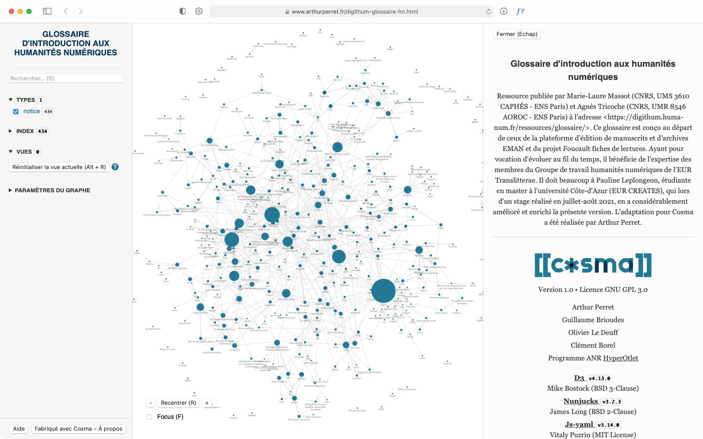

# Liens vers les graphes

- [graphe groupe 1](https://damienbelveze.github.io/obsidian_biniou/cosmoscope.html)
- graphe groupe 2 (à paraître)
- graphe groupe 3 (à paraître)

# Outils utilisés :

| fonction | outil |
|:---:|:---:|
| éditeur de notes | Atom |
| éditeur de graphe | Cosma |
| hébergement des notes | github |
